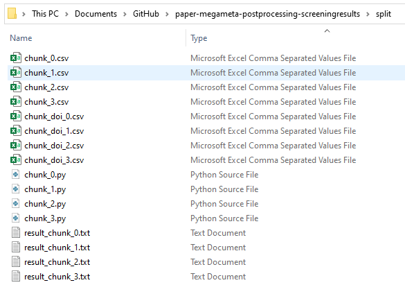

[](https://zenodo.org/badge/latestdoi/416328702)


# Scripts for Post-Processing Mega-Meta Results

The repository is part of the so-called, Mega-Meta study on reviewing factors
contributing to substance use, anxiety, and depressive disorders. The study
protocol has been pre-registered at
[Prospero](https://www.crd.york.ac.uk/prospero/display_record.php?ID=CRD42021266297).
The procedure for obtaining the search terms, the exact search query, and
selecting key papers by expert consensus can be found on the [Open Science
Framework](https://osf.io/m5uhy/).

The screening was conducted in the software ASReview ([Van de Schoot et al.,
2020](https://www.nature.com/articles/s42256-020-00287-7) using the protocol
as described in [Hofstee et al. (2021)](https://osf.io/3znar/). The server
installation is described in [Melnikov
(2021)](https://github.com/valmelnikov/asreview_server_setup), and training of the
hyperparameters for the CNN-model is described by [Tijema et al
(2021)](https://github.com/asreview/paper-megameta-hyperparameter-training). The
data can be found on DANS [LINK NEEDED].

The current repository contains the post-processing scripts to:

1.	Merge the three output files after screening in
ASReview;
2.	Obtain missing DOIs;
3.	Apply another round of de-duplication ([the first round](https://osf.io/m5uhy/) of de-duplication was applied before the screening started).
4. Deal with noisy labels corrected in two rounds of quality checks;

The scripts in the current repository result in one single dataset that can be
used for future meta-analyses. The dataset itself is available on DANS[NEEDS
LINK].  

## Datasets


### Test Data
The `/data` folder contains test-files which can be used to test the pipeline.

```
NOTE: When you want to use these test files; please make sure that the empirical
data is not saved in the `/data` folder because the next step will overwrite these files.
```

1. Open the `pre-processing.Rproject` in Rstudio;
2. Open `scrips/change_test_file_names.R` and run the script. The test files
will now have the same file names as those of the empirical data.
3. Continue with **Running the complete pipeline**.

#### Results of the test data
To check whether the pipeline worked correctly on the test data, check the following
values in the output:

- Within the `crossref_doi_retrieval.ipynb` script 33/42 doi's should be retrieved.
- After two rounds of deduplication in `master_script_deduplication.R` the total number of relevant papers
(sum of the values in the composite_label column) should be 21.
- After running the quality_check function in  `master_script_quality_check.R` the number of changed labels
should be:
  - Quality check 1: 7
  - Quality check 2: 6

### Empirical Data

The empricial data is available on DANS[NEEDS LINK]. Request access, donwload the files,
and add the required data into the `/data` folder.

### Data Files Names

The following nine datasets should be available in `/data`:

The three export-datasets with the partly labelled data after screening in
ASReview:  
  - `anxiety-screening-CNN-output.xlsx`
  - `depression-screening-CNN-output.xslx`
  - `substance-screening-CNN-output.xslx`

The three datasets resulting from Quality Check 1:
 - `anxiety-incorrectly-excluded-records.xlsx`
 - `depression-incorrectly-excluded-records.xlsx`
 - `substance-incorrectly-excluded-records.xlsx`

The three datasets resulting from Quality Check 2:
 - `anxiety-incorrectly-included-records`
 - `depression-incorrectly-included-records`
 - `substance-incorrectly-included-records`

## Requirements to get started

To get started:
1. Open the `pre-processing.Rproject` in Rstudio;
2. Open `scripts/master_script_merging_after_asreview.R`;
3. Install, if necessary, the packages required by uncommenting the lines and running them.
4. Make sure that at least the following columns are present in the data:
    - `title`
    - `abstract`
    - `included`
    - `year` (may be spelled differently as this can be changed within `crossref_doi_retrieval.ipynb`)


## Running the complete pipeline

1. Open the `pre-processing.Rproject` in Rstudio and run the `master_script_merging_after_asreview.R` to merge the datasets.
At the end of the merging script, the file `megameta_asreview_merged.xlsx` is created and saved in `/output`.
2. Run the `scripts/crossref_doi_retrieval.ipynb` in [jupyter notebook](https://jupyter.org/install) to retrieve the missing doi's (you might need to install the package tqdm first: `pip install tqdm`). The output from the doi retrieval is stored in `/output`:
   `megameta_asreview_doi_retrieved.xlsx`. Note: This step might take some time!
   To significantly decrease run time, follow the steps in the [Improving DOI retrieval
   speed](#Improving-DOI-retrieval-speed) section.
3. For the deduplication part, open and run `scripts/master_script_deduplication.R`
back in the Rproject in Rstudio. This result is stored in `/output`: `megameta_asreview_deduplicated.xslx`
4. Two quality checks are performed. Manually change the labels
    1. of incorrectly excluded records to included.
    2. of incorrectly included records to excluded.  
   The data which should be corrected is available on DANS. 
   This step should add the following columns to the dataset:
- `quality_check_1(0->1)` (1, 2, 3, NA):
  This column indicates for which subjects a record was falsely excluded:
  - 1 = anxiety
  - 2 = depression
  - 3 = substance-abuse
- `quality_check_2(1->0)` (1, 2, 3, NA):
  This column indicates for which subjects a record was falsely included:
  - 1 = anxiety
  - 2 = depression
  - 3 = substance-abuse
- `depression_included_corrected` (0, 1, NA):
  Combining the information from the depression_included and quality_check columns,
  this column contains the inclusion/exclusion/not seen labels after correction.
- `substance_included_corrected` (0, 1, NA):
    Combining the information from the substance_included and quality_check columns,
    this column contains the inclusion/exclusion/not seen labels after correction.
- `anxiety_included_corrected` (0, 1, NA):
  Combining the information from the anxiety_included and quality_check columns,
  this column contains the inclusion/exclusion/not seen labels after correction.
- `composite_label_corrected` (0, 1, NA):
  A column indicating whether a record was included in at least one of the
  corrected_subject columns: The results after taking the quality checks into account.
5. OPTIONAL: Create ASReview plugin-ready data by running the script `master_script_process_data_for_asreview_plugin.R`.
This script creates a new folder in the output folder, `data_for_plugin`, containing several versions
of the dataset created from step 4. See [Data for the ASReview plugin](#data-for-the-asreview-plugin) for more information.

### Improving DOI retrieval speed
It is possible to improve the speed of the doi retrieval by using the following steps:

1. Split the dataset into smaller chunks by running the `split_input_file.ipynb`
   script. Within this script is the option to set the amount of chunks. If the
   records aren't split evenly, the last chunk might be smaller than the others.
2. For each chunk, create a copy of the `chunk_0.py` file, and place it in the
   `split` folder. Change the name `chunk_0.py` to `chunk_1.py`, `chunk_2.py`,
   etc, for each created chunk.
3. Within each file, change `script_number` = "0" to `script_number` = "1",
   `script_number` = "2", etc.
4. Run each `chunk_*.py` file in the `split` folder simultaneously from a
   separate console. The script stores the console output to a respective
   `result_chunk_*.txt` file.
5. Use the second half of `merge_files.ipynb` to merge the
   results of the `chunk_*.py` scripts.
6. The resulting file will be stored in the same way as the
   `crossref_doi_retrieval.ipynb` would.

The split folder should look like this after each chunk has been run:


## Deduplication strategy

Keeping in mind that deduplication is never perfect,
`scripts/master_script_deduplication.R` contains a function to deduplicate the
records in a very conservative way. It is assumed that it is better to miss
duplicates within the data, than to falsely deduplicate records.

Therefore deduplication within the `master_script_deduplication.R` is based on
two different rounds of deduplication. The first round uses the digitial
object identifier (doi) to identify duplicates. However, many doi's, even
after doi-retrieval, are still missing. Or in some cases the doi's may be
different for otherwise seemingly identical records. Therefore, an extra round
of deduplication is applied to the data. This conservative strategy was
devised with the help of @bmkramer. The code used a deduplication script by
@terrymyc as inspiration.


The exact strategy of the second deduplication round is as follows:
1. Set all necessary columns (see below) for deduplication to lowercase characters and remove any punctuation marks.
2. Count duplicates identified using conservative deduplication strategy. This strategy will identify duplicates based on:
  - Author
  - Title
  - Year
  - Journal or issn (if either journal or issn is an exact match, together with the above, the record is marked as a duplicate)
3. Count duplicates identified using a less conservative deduplication strategy. This strategy will identify duplicates based on:
  - Author
  - Title
  - Year
4. Deduplicate using the strategy from 2.

The deduplication script will also print the number of identified duplicates
for both the conservative strategy and a less conservative strategy based on
only authors, title, and year. In this way, we can compare the impact of
different duplication strategies.

## Data for the ASReview plugin.
The script `master_script_process_data_for_asreview_plugin.R` creates a new folder in the output folder, `data_for_plugin`, containing several versions of the dataset created from [step 4](#running-the-complete-pipeline).

1. `megameta_asreview_partly_labelled`:
A dataset where a column called `label_included` is added, which is an exact copy of the composite_label_corrected.
2. `megameta_asreview_only_potentially_relevant`:
A dataset with only those records which have a 1 in composite_label_corrected
3. `megameta_asreview_potentially_relevant_depression`:
A dataset with only those records which have a 1 in depression_included_corrected
4. `megameta_asreview_potentially_relevant_substance`:
A dataset with only those records which have a 1 in substance_included_corrected
5. `megameta_asreview_potentially_relevant_anxiety`:
A dataset with only those records which have a 1 in anxiety_included_corrected

[INSTRUCTIONS FOR PLUGIN?]

## Post-processing functions

-  `change_test_file_names.R` - With this script the filenames of the test files are converted to the empirical datafile names.
-  `merge_datasets.R` - This script contains a function to merge the datasets. An unique included column is added for each dataset before the merge.
-  `composite_label.R` - This script contains a function to create a column with the final inclusions.
- `print_information_datasets.R` - This script contains a function to print information on datasets.
-  `identify_duplicates.R` - This script contains a function to identify duplicate records in the dataset.
-  `deduplicate_doi.R` - This script contains a function to deduplicate the records, based on doi, while maintaining all information.
-  `quality_check.R` - This script corrects those labels which were incorrect according to 2 quality checks: Quality check 1 (incorrectly assigned irrelevant), Quality check 2 (incorrectly assigned relevant).
-  `deduplicate_for_q-check_titles.R` - This script is used in the `quality_check.R` to deduplicate the records from the quality check based on title.
-  `deduplicate_conservative.R` - this script contains a function to deduplicate the records in a  conservative way based on title, author, year and journal/issn

## Result

The result of running all master scripts up until [step 4](#running-the-complete-pipeline)
in this repository is the file
`output/megameta_asreview_quality_checked.xslx`. In this dataset the following
columns have been added:

- `index` (1-165045):
  A simple indexing column going from 1-165045. Some numbers are not present
  because they have been removed after deduplication.
- `unique_record` (0, 1, NA):
  Indicating whether the column has a unique DOI. This is NA when there is no
  DOI present.
- `depression_included` (0, 1, NA):
  A column indicating whether a record was included in depression.
- `anxiety_included` (0, 1, NA):
  A column indicating whether a record was included in anxiety.
- `substance_included` (0, 1, NA):
  A column indicating whether a record was included in substance_abuse.
- `composite_label` (0, 1, NA):
  A column indicating whether a record was included in at least one of the
  subjects.
- `quality_check_1(0->1)` (1, 2, 3, NA):
  This column indicates for which subjects a record was falsely excluded:
  - 1 = anxiety
  - 2 = depression
  - 3 = substance-abuse
- `quality_check_2(1->0)` (1, 2, 3, NA):
  This column indicates for which subjects a record was falsely included:
  - 1 = anxiety
  - 2 = depression
  - 3 = substance-abuse
- `depression_included_corrected` (0, 1, NA):
  Combining the information from the depression_included and quality_check columns,
  this column contains the inclusion/exclusion/not seen labels after correction.
- `substance_included_corrected` (0, 1, NA):
    Combining the information from the substance_included and quality_check columns,
    this column contains the inclusion/exclusion/not seen labels after correction.
- `anxiety_included_corrected` (0, 1, NA):
  Combining the information from the anxiety_included and quality_check columns,
  this column contains the inclusion/exclusion/not seen labels after correction.
- `composite_label_corrected` (0, 1, NA):
  A column indicating whether a record was included in at least one of the
  corrected_subject columns: The results after taking the quality checks into account.
- `data_extracted` (0, 1, NA):
  An empty column to be filled manually about which records have been extracted.

For all columns where there are only 0's 1's and NA's, a `0` indicates a negative
(excluded for example), while `1` indicates a positive (included for example). `NA`
means `Not Available`.


## Funding
This project is funded by a grant from the Centre for Urban Mental Health, University of Amsterdam, The Netherlands

## Licence
The content in this repository is published under the MIT license.

## Contact
For any questions or remarks, please send an email to the [ASReview-team](mailto:asreview@uu.nl) or [Marlies Brouwer](https://orcid.org/0000-0002-9972-9058).
